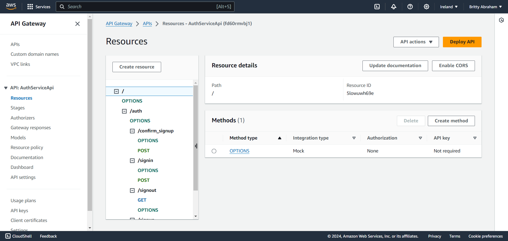
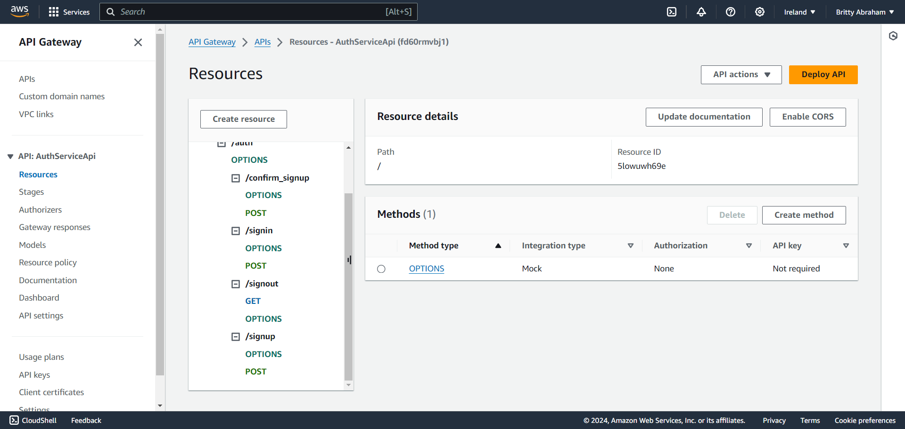
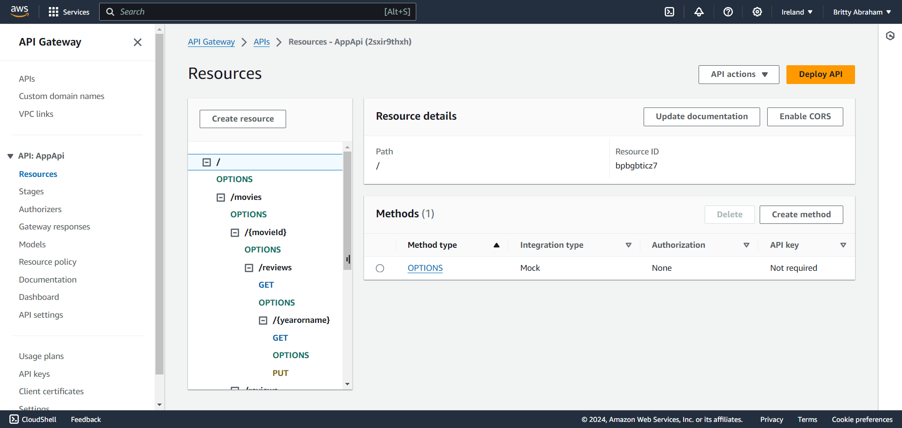
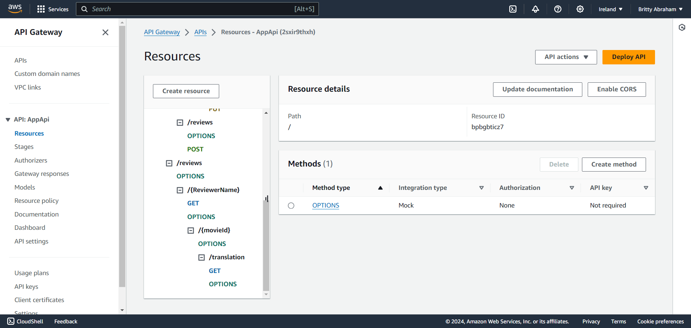
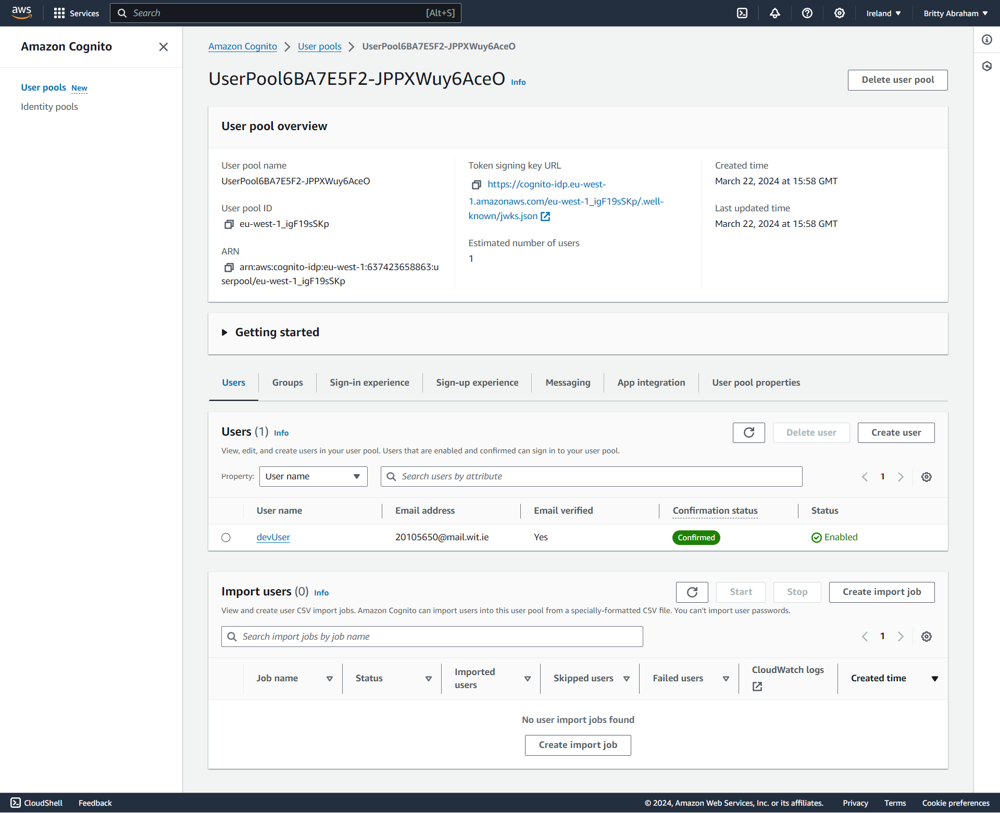
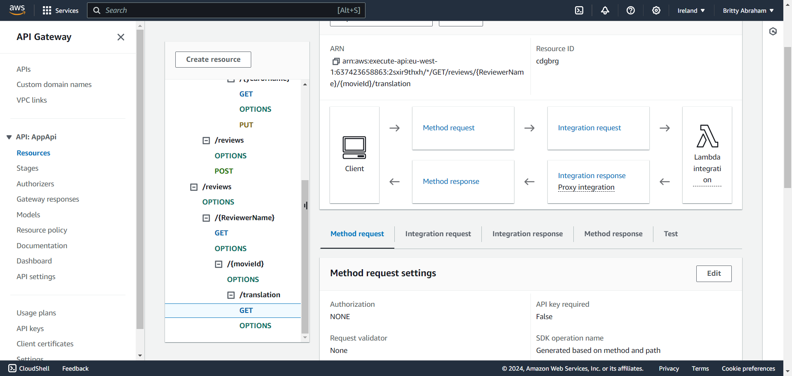

## Serverless REST Assignment.

__Name:__ Britty Abraham

__Video demonstration:__ ..... https://youtu.be/ATIuTEmM8vM ....

This repository contains an implementation of a serverless REST API for the AWS platform. The CDK framework is used to provision its infrastructure. The API's domain context is movie reviews.

### API endpoints.
 
+ POST /movies/reviews - To add a movie review.
+ GET /movies/{movieId}/reviews - Get all the reviews for a movie with the specified id.
+ GET /movies/{movieId}/reviews?minRating=n - Get all the reviews for the film with the specified ID whose rating was higher than the minRating.
+ GET /movies/{movieId}/reviews/{reviewerName} - Get the review for the movie with the specified movie ID and written by the named reviewer.
+ PUT /movies/{movieId}/reviews/{reviewerName} - Update the text of a review of the movie with the specified movie ID and written by the named reviewer.
+ GET /movies/{movieId}/reviews/{year} - Get the reviews written in a specific year for a specific movie.
+ GET /reviews/{reviewerName} - Get all the reviews written by a specific reviewer.
+ GET /reviews/{reviewerName}/{movieId}/translation?language=code - Get a translated version of a movie review using the movie ID and reviewer name as the identifier.

Below are the AWS management console (API Gateway service) that clearly show the deployed API.

### Authentication (if relevant).

AWS management console (Cognito User Pools) showing a confirmed user account.

### Independent learning (If relevant).

Add a translation endpoint

